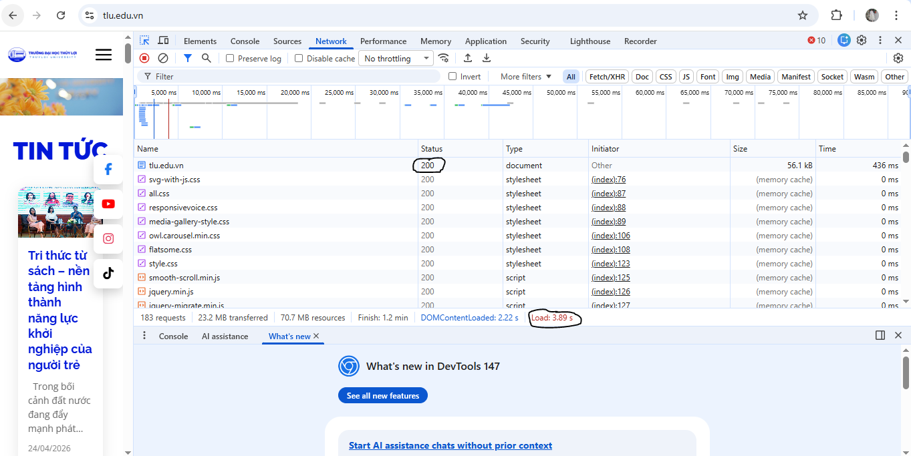
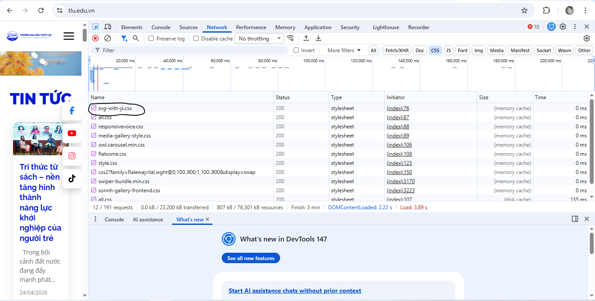

# TRẢ LỜI PHIẾU BÀI TẬP 01
**Họ và tên:** [Nguyễn Khắc Phát]
**Mã SV:** [2451060705]

---

## PHẦN A — KIỂM TRA ĐỌC HIỂU

### Câu A1 — HTTP & Browser

**1. Các bước xảy ra khi truy cập `https://shopee.vn`:**
* **Bước 1 (DNS Lookup):** Trình duyệt gửi yêu cầu tới máy chủ phân giải tên miền (DNS) để dịch tên miền `shopee.vn` sang địa chỉ IP vật lý của máy chủ.
* **Bước 2 (TCP/TLS Handshake):** Trình duyệt thiết lập kết nối TCP với máy chủ và thực hiện bắt tay bảo mật TLS để mã hóa dữ liệu (vì dùng HTTPS).
* **Bước 3 (HTTP Request):** Trình duyệt gửi một yêu cầu HTTP (GET request) đến máy chủ để xin tải nội dung trang web.
* **Bước 4 (HTTP Response):** Máy chủ xử lý yêu cầu và trả về các tài nguyên tĩnh như file HTML, CSS, JavaScript, hình ảnh... kèm theo Status Code (ví dụ: 200 OK).
* **Bước 5 (Rendering):** Trình duyệt phân tích cú pháp HTML để tạo DOM tree, phân tích CSS để tạo CSSOM, kết hợp chúng lại thành Render Tree và vẽ (paint) giao diện trang web lên màn hình.

**2. Ảnh chụp DevTools (Tab Network):**
**Trả lời**: Tab Network (Mạng) trong DevTools hiển thị toàn bộ quá trình giao tiếp giữa trình duyệt và máy chủ. Nó ghi lại danh sách tất cả các tài nguyên (HTML, CSS, JS, hình ảnh, API...) được tải xuống, kèm theo các thông tin chi tiết như: dung lượng file, thời gian tải của từng file, và mã trạng thái.
**Ảnh chụp**




### Câu A2 — Semantic HTML

Trang web bị Google đánh giá SEO thấp vì mắc lỗi "Div soup" (lạm dụng thẻ `<div>`), khiến công cụ tìm kiếm và trình đọc màn hình không phân biệt được vai trò của từng khu vực. 

**4 lỗi semantic cụ thể:**
1. `<div class="header">`: Nên dùng thẻ `<header>` để xác định phần đầu trang.
2. `<div class="menu">`: Nên dùng thẻ `<nav>` để biểu diễn cụm liên kết điều hướng.
3. `<div class="main">`: Nên dùng thẻ `<main>` để bọc nội dung chính của trang.
4. `<div class="product">`: Nên dùng thẻ `<article>` để bọc một thực thể nội dung độc lập.

**Code sửa lại chuẩn Semantic:**
```html
<header>
    <div class="logo">ShopTLU</div>
    <nav>
        <a href="/">Trang chủ</a>
        <a href="/products">Sản phẩm</a>
    </nav>
</header>
<main>
    <article class="product">
        <h2 class="title">iPhone 16 Pro</h2>
        <p class="price">25.990.000đ</p>
        <figure class="image"></figure>
    </article>
</main>
```
### Câu A3 — Block vs inline
**Kết quả text art:**
Hộp 1
Text A Text B
Hộp 2
Text C Text D
Hộp 3
**Giải thích:**
```
<div> là thẻ Block-level: Nó luôn bắt đầu ở một dòng mới và chiếm toàn bộ chiều rộng có sẵn. Do đó Hộp 1, Hộp 2, Hộp 3 bị ngắt dòng.

<span> và <strong> là thẻ Inline-level: Nó chỉ chiếm không gian vừa đủ cho nội dung và không tạo dòng mới. Do đó "Text A" và "Text B" sẽ nằm sát nhau trên cùng 1 dòng; "Text C" và "Text D" cũng nằm sát nhau trên cùng 1 dòng tiếp theo.
```
### Câu A4 - Table
**Sự khác nhau:**
Sự khác nhau:
```
<thead>: Định nghĩa phần tiêu đề của bảng (các cột).

<tbody>: Chứa phần thân của bảng (dữ liệu chính).

<tfoot>: Định nghĩa phần chân bảng (thường dùng để tổng kết, tính tổng).
```
**Lý do không nên dùng TABLE để layout trang web:**
Phá vỡ Accessibility (Khả năng tiếp cận): Trình đọc màn hình cho người khiếm thị sẽ đọc layout theo cấu trúc hàng/cột của bảng một cách máy móc, khiến họ không hiểu được luồng thông tin thực tế.

Kém Responsive: Bảng rất cứng nhắc, khó co giãn hoặc dàn lại bố cục trên các màn hình thiết bị di động (điện thoại, tablet) bằng CSS.

Chậm tốc độ hiển thị: Trình duyệt phải phân tích và tính toán kích thước của toàn bộ bảng trước khi hiển thị lên màn hình, làm chậm thời gian render so với layout bằng thẻ Block thông thường.
## PHẦN C — SUY LUẬN
### Câu C1 - Thiết kế cấu trúc
**Trả lời:**
```html
<header> <nav> <ul> <li><a href="/">Trang chủ</a></li> </ul>
    </nav>
</header>

<main> <nav aria-label="breadcrumb"> <ol> <li><a href="/">Trang chủ</a></li> <li><a href="/dien-thoai">Điện thoại</a></li>
            <li>iPhone 16</li> </ol>
    </nav>

    <article> <section id="gallery"> <figure>      </figure>
        </section>

        <section id="info"> <h1>iPhone 16</h1> <p>Giá: 25.990.000đ</p> <p>Đánh giá: 5 sao</p>
            <p>Mô tả sản phẩm...</p>
        </section>

        <section id="specs"> <h2>Thông số kỹ thuật</h2> <table> <thead> <tr> <th>Thuộc tính</th> <th>Chi tiết</th>
                    </tr>
                </thead>
                <tbody> <tr>
                        <td>Màn hình</td> <td>6.1 inch</td>
                    </tr>
                </tbody>
            </table>
        </section>

        <section id="reviews"> <h2>Đánh giá/Bình luận</h2> <article> <h3>Người dùng A</h3> <p>Sản phẩm rất tốt!</p> </article>
        </section>

    </article>

    <aside> <h2>Sản phẩm tương tự</h2> <ul> <li><a href="/sp2">iPhone 15</a></li> </ul>
    </aside>

</main>

<footer> <p>Copyright 2026</p> </footer>
```
### Câu C2 - So sánh & tranh luận
**Trả lời:**
```
Việc sử dụng thẻ Semantic HTML (như <header>, <main>, <article>) thay vì lạm dụng <div> không hề lãng phí thời gian, mà là tiêu chuẩn bắt buộc để tạo ra một website chất lượng cao vì những lý do kỹ thuật sau:

Thứ nhất, về mặt SEO (Tối ưu hóa công cụ tìm kiếm), các bot của Google không "nhìn" bằng mắt mà đọc mã nguồn. Nếu chỉ dùng <div>, Google không thể biết đâu là nội dung bài viết chính, đâu là quảng cáo bên lề. Semantic HTML dán nhãn ý nghĩa cho từng vùng, giúp bot lập chỉ mục chính xác, từ đó tăng thứ hạng website.

Thứ hai, về mặt Accessibility (Khả năng tiếp cận), những người khiếm thị sử dụng trình đọc màn hình (Screen Reader) phụ thuộc hoàn toàn vào cấu trúc Semantic. Ví dụ cụ thể: Một trình đọc màn hình có tính năng cho phép người dùng bấm phím tắt để nhảy thẳng đến vùng <nav> để tìm menu, hoặc nhảy thẳng đến <main> để đọc tin tức. Nếu trang web dùng "Div soup", họ sẽ phải nghe máy đọc từng dòng một từ trên xuống dưới một cách cực hình.

Tuy nhiên, <div> không hề vô dụng. <div> là một khối không mang ý nghĩa ngữ nghĩa (meaningless container). Nó cực kỳ phù hợp trong trường hợp cần tạo ra các lớp vỏ bọc (wrapper) thuần túy để dàn layout bằng CSS. Ví dụ: Khi cần gom 3 cái thẻ <article> lại với nhau và bọc bên ngoài một <div class="flex-container"> để dàn chúng nằm ngang bằng Flexbox. Ở đây, thẻ <div> làm rất tốt nhiệm vụ cấu trúc giao diện mà không phá hỏng ý nghĩa ngữ nghĩa của luồng tài liệu.
```
## PHẦN B - THỰC HÀNH CODE
### Câu B3 - Debug
**Trả lời:**
```
Lỗi 1: Dòng 1 — Khai báo DOCTYPE thiếu chữ "html" — Sửa thành `<!DOCTYPE html>`
Lỗi 2: Dòng 4 — Thẻ title không có thẻ đóng — Sửa thành `<title>Trang web</title>`
Lỗi 3: Dòng 5 — Giá trị của charset bị sai chuẩn — Sửa thành `<meta charset="UTF-8">`
Lỗi 4: Dòng 8 — Thẻ đóng h1 bị sai cú pháp (thiếu dấu `/`) — Sửa thành `</h1>`
Lỗi 5: Dòng 12 — Thẻ đóng a bị sai cú pháp (thiếu dấu `/`) — Sửa thành `</a>`
Lỗi 6: Dòng 19 — Thuộc tính src thiếu dấu ngoặc kép và thẻ img thiếu thuộc tính alt — Sửa thành ``
Lỗi 7: Dòng 21 — Lồng thẻ sai thứ tự (Overlapping tags), đóng thẻ p trước khi đóng thẻ b — Sửa thành `<p>Giá: <b>25.990.000đ</b></p>` (và nên thay `<b>` bằng `<strong>` cho chuẩn semantic).
Lỗi 8: Dòng 26, 27, 28 — Bảng không dùng thẻ `<th>` cho hàng tiêu đề, thiếu phân cụm `<thead>` và `<tbody>` — Sửa các `<td>` của hàng đầu tiên thành `<th>`.
Lỗi 9: Dòng 38 — Một trang web không được có 2 thẻ `<main>`. Ngoài ra phần này chứa "Sidebar" nên dùng thẻ main là sai ngữ nghĩa — Đổi `<main>` thứ hai thành `<aside>`.
Lỗi 10: Dòng 43 — Thẻ p thiếu thẻ đóng — Sửa thành `<p>Copyright 2026</p>`
```
### Câu B4 - Phân tích trang web thật(tiki.vn)
**Trả lời:**
**1. 3 thẻ mà semantic HTML5 mà shopee sử dụng là:**

- <header> nằm trong khối <div id = "main">
- <footer> nằm trong khối <div id = "main">
- <section> nằm ở phần thân trang
  2 thẻ mà chưa dùng đúng semantic:
- Lạm dụng thẻ <div> bọc ngoài thay vì <main>
- Một số menu điều hướng dùng <div> thay vì <nav>
  **2. Qua quá trình kiểm tra thực tế bằng DevTools,** phát hiện ra trang web không sử dụng thẻ <table> chuẩn cho phần thông số kỹ thuật. Thay vào đó, họ lạm dụng các thẻ <div> kết hợp CSS để dàn trang dạng lưới
  **3. Phân tích thẻ <form> (Ô tìm kiếm trên Shopee.vn)**
- Action và Method: Rất đặc biệt, thẻ <form> không có thuộc tính action và method
- Input types được dùng:
  - Ô nhập từ khóa: Dùng thẻ <input> (Shopee không ghi rõ thuộc tính type, nên theo chuẩn HTML, trình duyệt sẽ mặc định nó là type="text").
  - Nút bấm kính lúp: Dùng <button type="button"> thay vì type="submit"
  
  